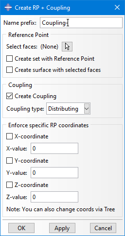

# Abaqus Plugin: RP+Coupling_Builder
Plugin for Abaqus/CAE that allows to quickly create Couplings and their Reference Points (RP)

 
More details:

This Plugin is intended for cases, where the reference point is to be placed in the geometric center of the connected region.

The user selects a face region (can be one or multiple faces) and the Plug-In creates a RP at the geometric center and adds a coupling in between. Additionally the user can overrule specific components of the calculated RP coordinates, for example when the RP has to be created at a specific axis. Overall this is much faster than creating those features manually, especially when you need many couplings (e.g. when creating a substructure).

The Plug-In is only for creating these features. Editing or deleting has to be done with the regular options of Abaqus/CAE.

See also demo video in media folder.

 

Usage at your own risk.